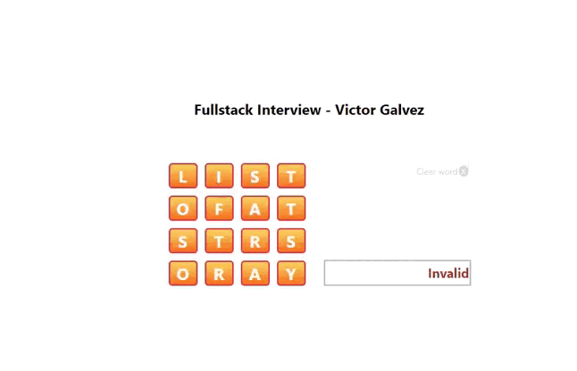

<!-- GETTING STARTED -->
## Getting Started

This is a coding challenge for applicants interested in joining Enara Health.

### Prerequisites

This is an example of how to list things you need to use the software and how to install them.
* Setting up the development environment
  ```sh
  https://en.reactjs.org/docs/getting-started.html
  ```

### Installation

_Instructions to be able to upload the project in android or ios._

1. Clone the repo
   ```sh
   git clone https://github.com/victorgalvez56/fullstack-interview-react-web.git
   ```
2. Install NPM packages
   ```sh
   npm install
3. Start app
   ```sh
   npm start
   ```

### Additional

_Resolved points._
1. Each tile can be selected once: The user cannot select the same tile twice.
 
2. Extra points: After the first letter, the user can only select neighbor tiles to the last tile selected.
 
3. Extra points: Validate if the word is contained in a dictionary.json file. You can set up your board using the letters from our secondary board file, which contains many words from the dictionary!

3. Add a button (x) to reset the board, deselecting all tiles and clearing the word.!
  

### Example

